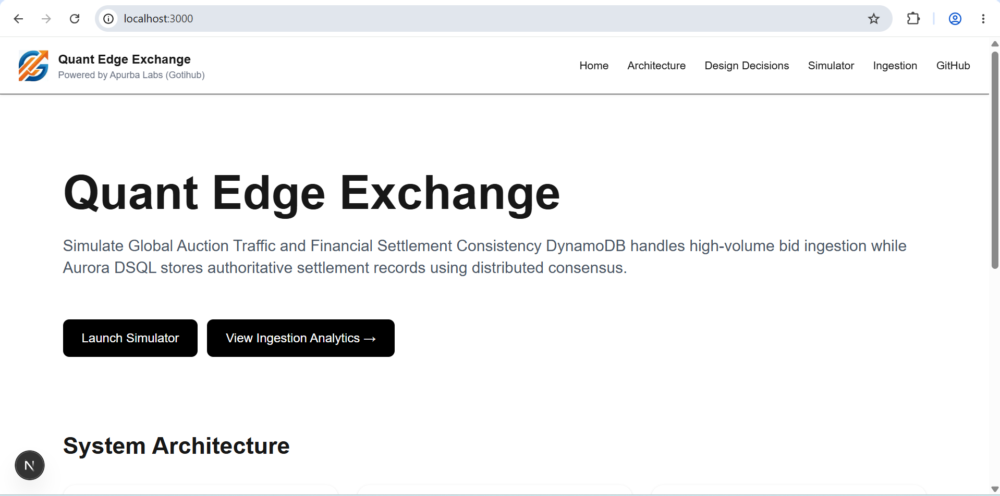
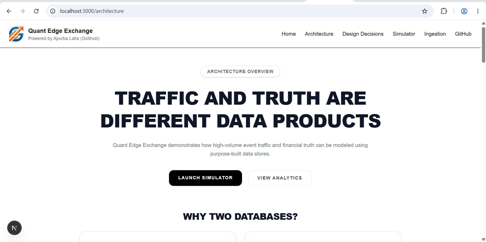
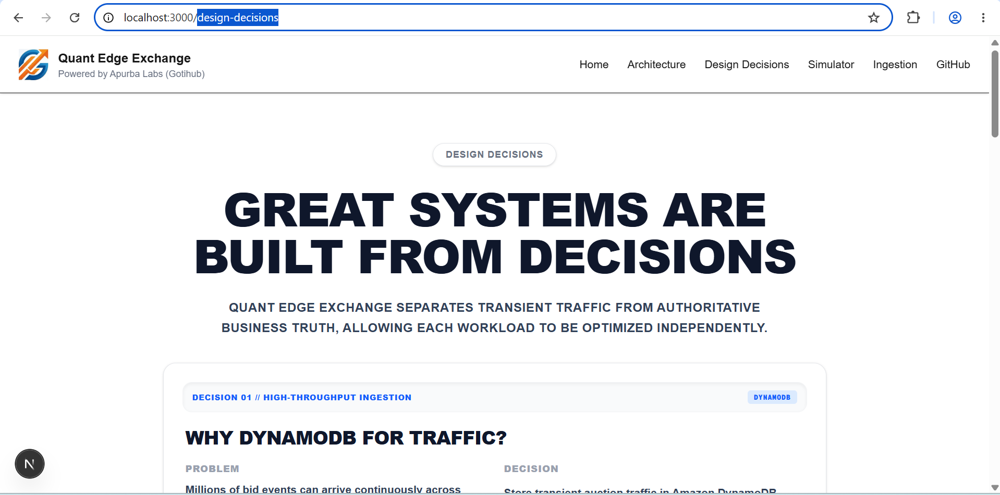
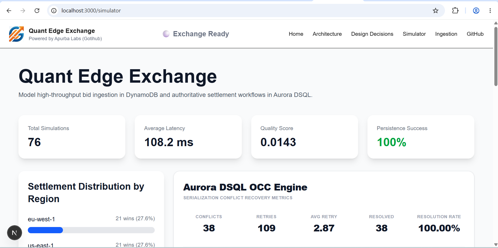
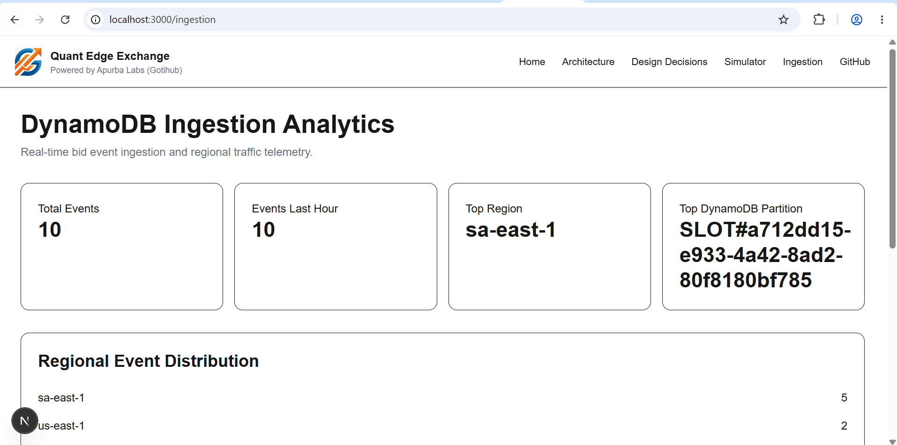

# Quant Edge Exchange

> Distributed Auction Settlement Platform powered by Amazon Aurora DSQL

## Demo

**Live Demo:** https://your-vercel-url.vercel.app

**Video Walkthrough:** https://youtube.com/your-video-link

---

## Overview

Quant Edge Exchange demonstrates a simple but powerful architectural principle:

> Not every event deserves global consistency.

Modern distributed systems process millions of events, but only a small subset becomes business-critical truth.

This project separates:

* High-volume auction traffic
* Authoritative financial settlement records

into specialized storage layers that optimize performance, scalability, and correctness.

---

## Key Architectural Insight

Auction traffic is abundant.

Financial truth is scarce.

Treat them differently.

| Data Type        | Storage Layer      |
| ---------------- | ------------------ |
| Auction Traffic  | Amazon DynamoDB    |
| Settlement Truth | Amazon Aurora DSQL |

The cost of coordination should match the value of the data.

---

## Screenshots

### Home Page



### Architecture Explorer



### Design Decisions



### Exchange Simulator



### Analytics Dashboard



---

## Problem Statement

Traditional architectures often force every event through the same database.

This creates:

* Transaction contention
* Serialization pressure
* Higher operational cost
* Scaling limitations
* Unnecessary consistency requirements

Quant Edge Exchange demonstrates a workload-aware architecture that separates traffic from truth.

---

## Architecture

### Traffic Layer

Amazon DynamoDB stores transient auction traffic.

Responsibilities:

* Bid ingestion
* Regional aggregation
* Event lifecycle management
* Telemetry collection

Benefits:

* Massive write throughput
* Low latency ingestion
* Independent scaling

---

### Truth Layer

Amazon Aurora DSQL stores authoritative business outcomes.

Responsibilities:

* Winning bids
* Settlement records
* Financial ledger
* Audit telemetry

Benefits:

* Serializable transactions
* Strong consistency
* Multi-region durability
* Financial correctness

---

## System Flow

```text
Global Auction Traffic
        │
        ▼
Amazon DynamoDB
(Traffic Layer)
        │
        ▼
Bid Evaluation Engine
        │
        ▼
Amazon Aurora DSQL
(Truth Layer)
        │
        ▼
Analytics & Audit Layer
```

---

## Design Decisions

### Decision 01

Why DynamoDB for traffic?

Millions of bid events arrive continuously and require fast ingestion without transactional overhead.

Chosen because:

* High throughput
* Horizontal scaling
* Event-oriented storage
* Regional aggregation support

---

### Decision 02

Why Aurora DSQL for settlement?

Winning bids become financial outcomes.

Incorrect settlements cannot be tolerated.

Chosen because:

* Serializable transactions
* Strong consistency
* Financial auditability
* Multi-region durability

---

### Decision 03

Why separate traffic from truth?

Treating every event as a transaction creates unnecessary coordination costs.

Benefits:

* Independent scaling
* Reduced contention
* Better cost efficiency
* Cleaner system boundaries

---

### Decision 04

Why OCC + Full Jitter?

Concurrent settlement operations can produce serialization conflicts.

The platform implements:

* Optimistic Concurrency Control
* Exponential Backoff
* Full Jitter Retry

Benefits:

* Conflict recovery
* Stable throughput
* Fair retry distribution
* Reduced retry storms

---

### Decision 05

Why not one database?

Single database architectures often combine:

* Temporary traffic
* Financial truth
* Analytics
* Operational telemetry

into a single workload.

This increases:

* Coordination cost
* Contention
* Complexity

Quant Edge Exchange separates workloads into specialized storage systems.

---

## Features

### Architecture Explorer

Interactive explanation of:

* Traffic Layer
* Truth Layer
* Analytics Layer
* Storage responsibilities
* Data flow

### Design Decisions

Detailed engineering rationale behind every major architectural choice.

### Exchange Simulator

Generate distributed auction traffic across:

* us-east-1
* eu-west-1
* ap-southeast-1
* sa-east-1

Features:

* Live simulation
* Settlement generation
* Conflict telemetry
* Persistence validation

### Analytics Dashboard

Tracks:

* Bid ingestion
* Settlements
* Conflict metrics
* Retry activity
* Regional traffic distribution

---

## Technology Stack

### Frontend

* Next.js 16
* TypeScript
* Tailwind CSS

### Data Layer

* Amazon DynamoDB
* Amazon Aurora DSQL

### Infrastructure

* AWS
* Vercel

### Security

* AWS SigV4 Authentication

### Observability

* Custom Analytics Dashboard
* Conflict Telemetry
* Audit Trail

---

## Local Development

Install dependencies:

```bash
npm install
```

Run development server:

```bash
docker compose up -d --build
npm run db:setup
npm run dev
```

Open:

```text
http://localhost:3000
```

---

## Project Structure

```text
src/
├── app/
│   ├── architecture/
│   ├── design-decisions/
│   ├── simulator/
│   ├── ingestion/
│   └── page.tsx
│
├── components/
├── context/
├── lib/
└── simulations/
```

---

## Key Takeaway

The central idea behind Quant Edge Exchange is simple:

> Not every event deserves global consistency.

High-volume traffic and business truth have fundamentally different requirements.

By separating them into specialized storage layers, systems can scale more efficiently while preserving correctness where it matters most.

---

## Author

**Apurba Singh**

Senior Solution Architect

Built for the Aurora DSQL Challenge.
